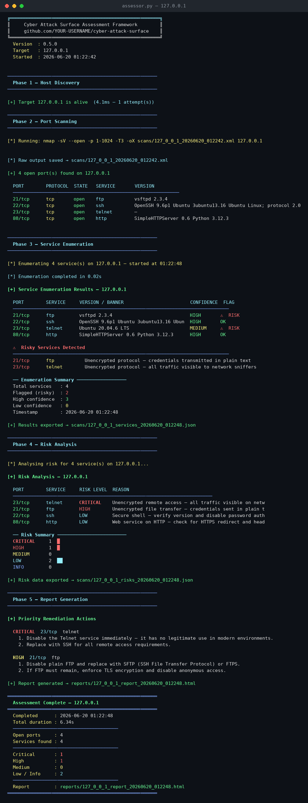
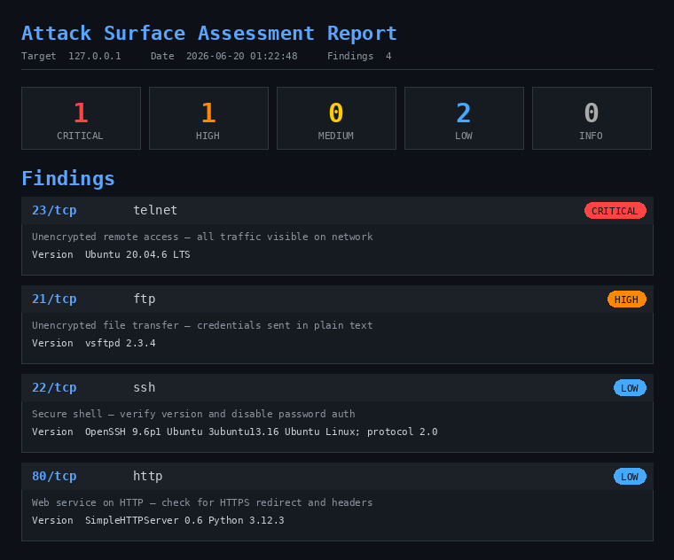

# Cyber Attack Surface Assessment Framework

A Python tool that automates the early stages of a security assessment — host discovery, port scanning, service enumeration, risk scoring, and report generation — from a single command.

```bash
python assessor.py 192.168.56.101
```

All five phases are complete and working end to end.

## Motivation

Most security tools abstract away the details of what they're actually doing. This project was an attempt to understand that process directly — what distinguishes an "open" port from a "confirmed" service, and what separates a finding that's merely noted from one that's flagged CRITICAL.

It also served as a deliberate exercise in writing production-style Python: structured modules, defensive error handling, and a commit history where each message documents the reasoning behind a change rather than just the change itself.

## Pipeline

```
Target
  │
  ▼
Host Discovery        — confirms the target is reachable
  │
  ▼
Port Scanning          — Nmap scan, parsed from structured XML
  │
  ▼
Service Enumeration    — banner grabbing, confidence scoring
  │
  ▼
Risk Analysis           — CRITICAL / HIGH / MEDIUM / LOW / INFO
  │
  ▼
Report Generation       — HTML report with targeted remediation steps
```

A run against a local test environment:



The corresponding findings, rendered as a report:



Both captures are from a live scan against a machine running a mix of normal and intentionally vulnerable services (plain FTP, Telnet) — nothing here is staged.

## Project structure

```
cyber-attack-surface-assessment/
│
├── scanner/
│   ├── host_discovery.py      # is the target reachable?
│   ├── port_scanner.py        # what ports are open?
│   └── service_enum.py        # what's running, and with what confidence?
│
├── analyzer/
│   ├── risk_analyzer.py       # how severe is each finding?
│   └── recommendations.py     # remediation steps and HTML report generation
│
├── reports/                   # generated HTML reports
├── scans/                     # raw Nmap XML and JSON exports (not committed)
├── screenshots/               # README assets
├── assessor.py                # orchestrates all five phases
├── requirements.txt
└── README.md
```

## How each phase works

**Host Discovery** sends a ping before any scanning begins, so the tool doesn't waste time on an unreachable target. Cross-platform, retries on failure, and reports response time.

**Port Scanning** wraps Nmap (`-sV --open`), saves the raw XML to `scans/`, and parses it into structured data the rest of the pipeline consumes. Port range and scan speed are both configurable.

**Service Enumeration** connects to every open port in parallel and attempts to read a banner, with SSL support where required. Each result is tagged with a confidence level — a banner we actually read carries more weight than a service Nmap merely inferred, and the risk scoring downstream reflects that distinction.

**Risk Analysis** checks both the service name and the port number, since Nmap doesn't always report the names you'd expect — port 445 is reported as `microsoft-ds`, not `smb`. That mismatch was a real bug in an earlier version: remediation advice for some of the most common findings (SMB, RDP, MSSQL) was silently falling back to generic guidance because the lookup table didn't recognize Nmap's raw service names. It's resolved now with an alias table, documented in the commit history.

**Report Generation** compiles everything into a single HTML file with remediation steps specific to each finding — not general advice, but concrete actions such as disabling SMBv1 and patching MS17-010.

## Setup

```bash
git clone https://github.com/harsha823/cyber-attack-surface-assessment.git
cd cyber-attack-surface-assessment
```

Nmap is the only external dependency:

```bash
sudo apt install nmap     # Linux
brew install nmap         # macOS
# Windows: https://nmap.org/download.html
```

No Python packages are required beyond the standard library.

```bash
python assessor.py <target-ip>
```

Each run produces a JSON export in `scans/` and an HTML report in `reports/`.

**Scope note:** this tool is intended for systems you own or have explicit written authorization to assess — your own lab environment, a platform such as TryHackMe or HackTheBox, or a sanctioned engagement. It is not intended for scanning systems without permission.

## Built with

Python 3 · `subprocess` · `socket` / `ssl` · `concurrent.futures` · `xml.etree.ElementTree` · Nmap

## Development notes

The commit history includes the bugs alongside the features, including the service-name mismatch described above. That history is left intact deliberately — it reflects the actual development process rather than a cleaned-up final state.

## License

MIT — see [LICENSE](LICENSE).
